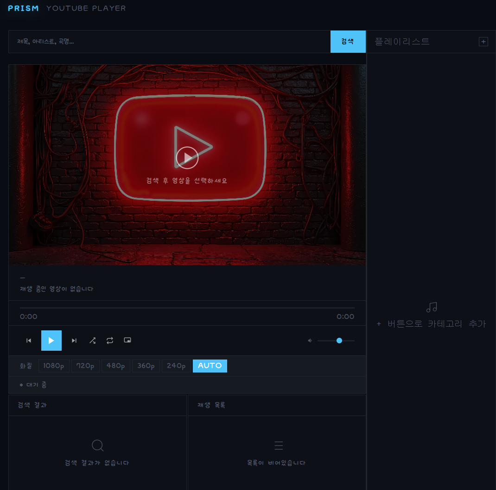
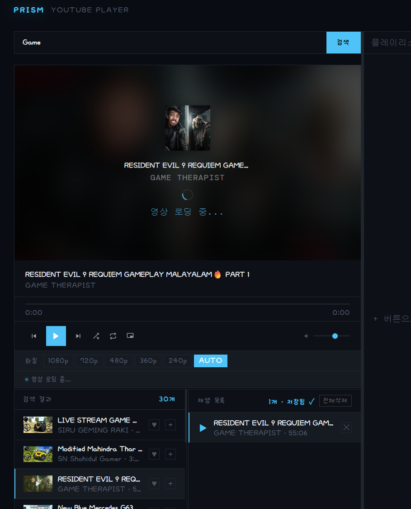
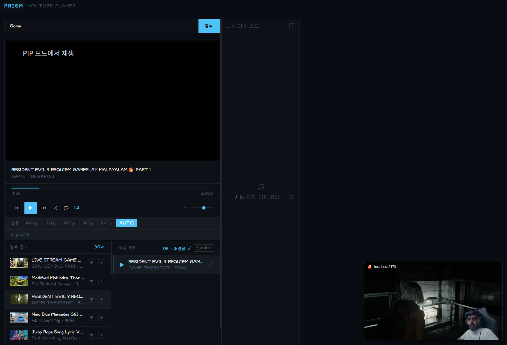
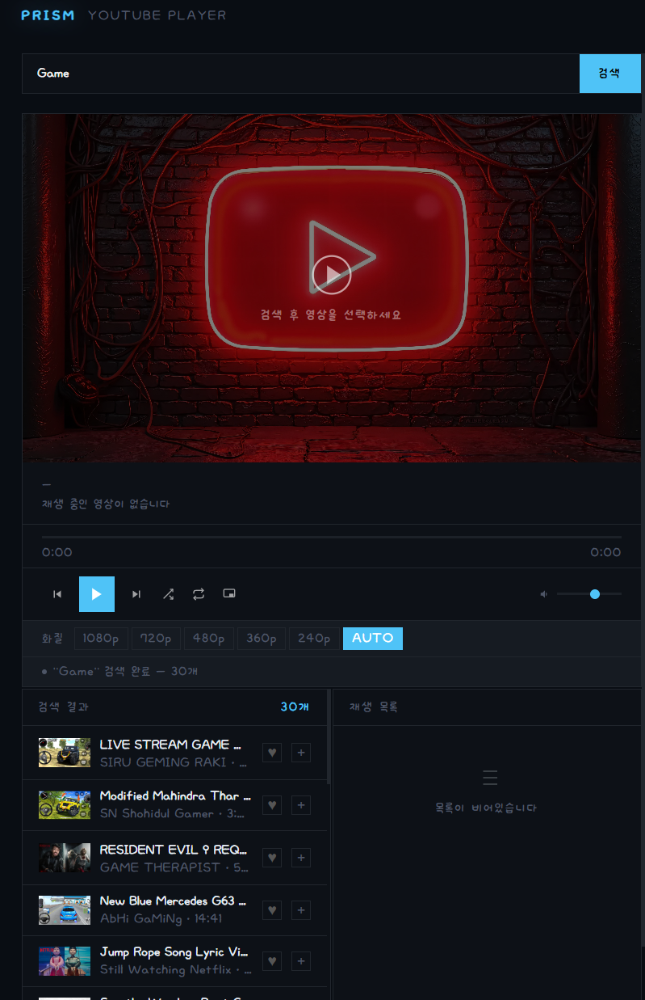
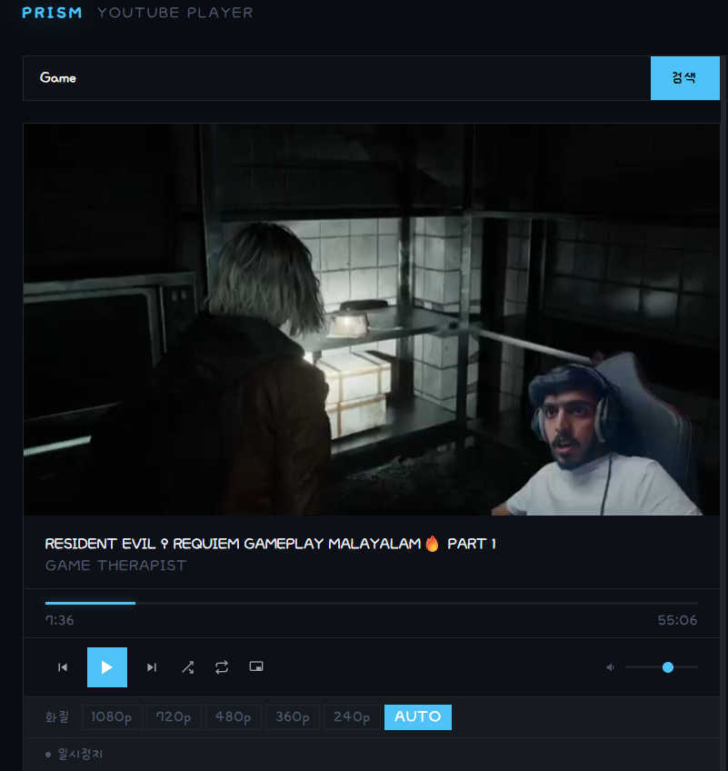
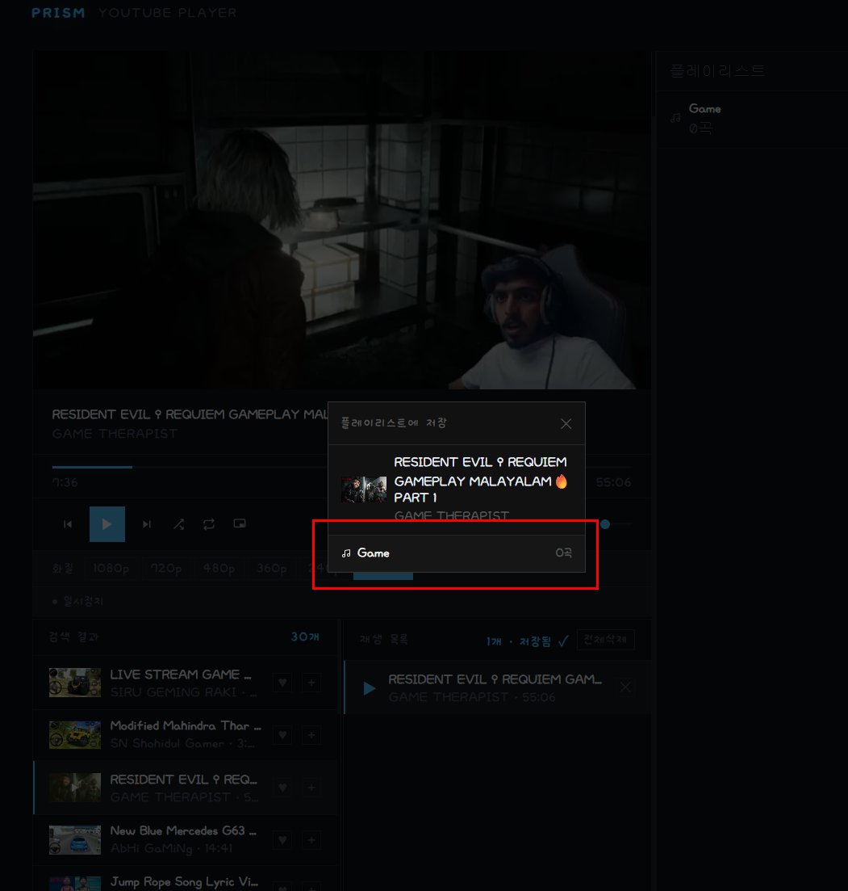

<div align="center">

# PRISM

**개인 로컬 전용 YouTube 플레이어**

[](LICENSE)


*SvelteKit · youtubei.js · yt-dlp*




</div>

---

> [!WARNING]
> **이 프로젝트는 개인 학습 목적으로 제작되었습니다.**  
> YouTube의 비공개 API(`InnerTube`)와 `yt-dlp`를 사용하며, YouTube 서비스 약관(ToS)을 위반할 수 있습니다.  
> **반드시 로컬(`localhost`) 환경에서만 사용하고, 공개 서버에 절대 배포하지 마세요.**

---

## 📸 Preview

> `static/main-banner.jpg` 에 원하는 이미지를 넣으면 초기 화면 배경으로 사용됩니다.

---

## ✨ Features

### 🎬 재생
- `<video>` 태그 기반 네이티브 재생 (yt-dlp 백엔드)
- 영상/오디오 분리 포맷 자동 감지 및 동기화
- **Picture-in-Picture** 브라우저 네이티브 PIP 지원
- **라이브 스트림** 자동 감지 → YouTube iframe 전환
- 화질 선택 (AUTO / 240p / 360p / 480p / 720p / 1080p)
- 스트림 URL 5분 캐시로 빠른 재생 전환




### 🔍 검색
- `youtubei.js` 기반 YouTube InnerTube 검색
- 무한 스크롤로 추가 결과 자동 로딩



### 📋 재생 큐
- 검색 결과에서 클릭 즉시 큐 추가 및 재생
- 전체 삭제 시 재생 즉시 중단
- 셔플 / 전체 반복 / 한 곡 반복 3단계 전환



### 📁 플레이리스트
- 카테고리별 영상 저장 (`localStorage` 영구 보존)
- 카테고리 추가 / 삭제 / 이름 변경
- 카테고리 전체 재생 버튼



### 🎨 UI / UX
- 3컬럼 레이아웃 (검색 | 플레이어 | 플레이리스트)
- 네온 글로우 로고 이펙트
- 로딩 중 썸네일 블러 배경 + 앨범아트 애니메이션
- 컬러 테마 (`#4fc3f7`)

---

## 🛠️ Tech Stack

| 분류 | 기술 |
|------|------|
| Frontend | SvelteKit 2.x + Svelte 5 |
| Backend | SvelteKit API Routes (Node.js) |
| YouTube 검색 | [youtubei.js](https://github.com/LuanRT/YouTube.js) |
| 영상 스트림 추출 | [yt-dlp](https://github.com/yt-dlp/yt-dlp) |
| HLS 파싱 | [hls.js](https://github.com/video-dev/hls.js) |
| 폰트 | DM Sans · DM Mono · Bebas Neue (Google Fonts) |

---

## 📦 Installation

### 1. 사전 요구사항

- **Node.js** 18 이상
- **yt-dlp** 로컬 설치

```bash
# Windows (winget)
winget install yt-dlp

# macOS
brew install yt-dlp

# Linux
sudo curl -L https://github.com/yt-dlp/yt-dlp/releases/latest/download/yt-dlp \
  -o /usr/local/bin/yt-dlp && sudo chmod +x /usr/local/bin/yt-dlp
```

### 2. 클론 및 실행

```bash
git clone https://github.com/your-username/prism.git
cd prism
npm install
npm run dev
```

브라우저에서 `http://localhost:5173` 접속

---

## ⚙️ Configuration

프로젝트 루트에 `.env` 파일을 생성하고 yt-dlp 경로를 설정하세요.  
`.env.example` 파일을 복사해서 사용하면 편합니다.

```bash
cp .env.example .env
```

```env
# .env

# Windows 예시
YTDLP_PATH=C:\Users\사용자명\AppData\Local\Microsoft\WinGet\Links\yt-dlp.exe

# macOS / Linux 예시
YTDLP_PATH=/usr/local/bin/yt-dlp
```

> `.env` 파일은 `.gitignore`에 포함되어 있어 깃허브에 업로드되지 않습니다.

---

## 📁 Project Structure

```
prism/
├── src/
│   ├── routes/
│   │   ├── +page.svelte              # 메인 UI (3컬럼 레이아웃)
│   │   └── api/
│   │       ├── search/+server.js     # youtubei.js 검색 + 무한스크롤
│   │       ├── stream/+server.js     # yt-dlp 스트림 프록시
│   │       └── hls/+server.js        # HLS 세그먼트 프록시
│   └── lib/
│       ├── components/
│       │   ├── YoutubePlayer.svelte  # 핵심 플레이어 컴포넌트
│       │   └── PlaylistPanel.svelte  # 플레이리스트 사이드 패널
│       ├── store.js                  # Svelte 전역 상태 (writable / persistent)
│       └── playlist.js               # 플레이리스트 localStorage 관리
└── static/
    └── main-banner.jpg               # 초기 화면 배경 (직접 추가)
```

---

## ⚠️ 법적 고지

이 프로젝트는 다음 비공식 수단을 사용합니다.

- **youtubei.js** — YouTube의 비공개 InnerTube API 클라이언트. 공식 지원 없음.
- **yt-dlp** — YouTube 스트림 URL 추출. YouTube ToS 위반 가능성 있음.

### ⛔ 금지 사항

- 공개 서버 배포 및 운영
- 상업적 목적 사용
- 타인의 저작권 콘텐츠 무단 배포
- 대규모 자동화 스크래핑

### ✅ 권장 사용 범위

- `localhost` 환경에서의 개인 감상
- 코드 학습 및 기술 연구

> 이 프로젝트 사용으로 발생하는 모든 법적 책임은 사용자 본인에게 있습니다.

---

# 🤝 Contributing

개인 프로젝트지만 버그 제보, 기능 제안, PR 모두 언제든 환영해요!

혼자 만든 프로젝트라 놓친 부분이 분명 있을 텐데, 관심 가져주신다면 정말 감사하겠습니다 🙏

- 🐛 버그 발견 → [Issues](issues) 에 제보해주세요
- 💡 기능 아이디어 → [Issues](issues) 에서 편하게 얘기해요
- 🔧 직접 고치고 싶다 → PR 올려주시면 바로 검토할게요

---

<div align="center">

Made with ❤️ for personal use only · **Do not deploy publicly.**

</div>